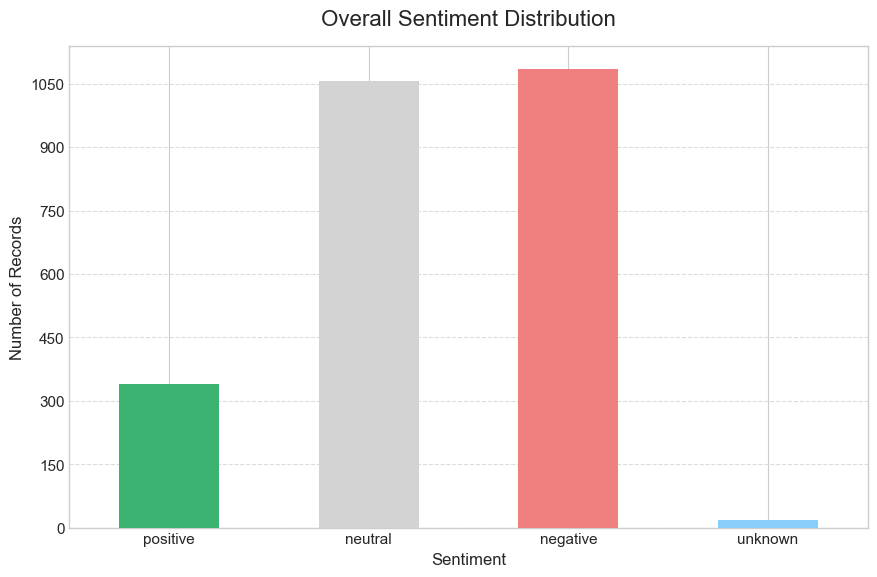
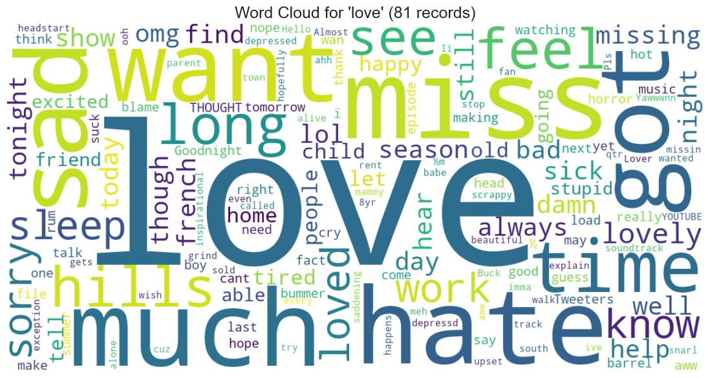

# Sentiment Analysis with RoBERTa

**Author:** Malek Elaghel
**Date:** May 3, 2025
**Contact:** [malekelaghel@gmail.com](mailto:malekelaghel@gmail.com)


## What it does

This project analyzes short texts from **Sentiment140** using a pretrained RoBERTa sentiment model. The workflow separates data loading, NLTK text preprocessing, batch scoring, and visualization into reusable modules.

It began with Twitter API collection and exploratory analysis around topics such as COVID, lockdowns, and vaccines. The current version uses a downloadable static dataset, so the workflow can be run without live API access.

By default, the application selects **2,500 tweets** from the dataset. It produces sentiment distributions, weekly trends, word clouds, and keyword-specific summaries. The model is used for inference; this project does not train or fine-tune RoBERTa. Keyword filtering uses substring matching, and the dataset's 2009 tweets limit what the outputs can say about current public opinion.

## Features & Analyses

* **Data Loading & Preparation:** Loads data from CSV, handles encoding, parses dates with error handling.
* **Text Preprocessing:** Utilizes a custom `SmartTextProcessor` class with NLTK for POS tagging (to preserve context like proper nouns/hashtags), handles URL/mention removal, normalizes elongated words, and cleans irrelevant characters.
* **RoBERTa Sentiment Scoring:** Employs the `cardiffnlp/twitter-roberta-base-sentiment-latest` model via the Hugging Face `transformers` library for sentiment classification (positive, neutral, negative). Uses batch processing for efficiency.
* **Overall Visualizations:**
    * Sentiment Distribution Bar Chart (Overall)
    * Word Cloud (Overall)
    * Sentiment Trend Over Time Line Plot (Weekly frequency by default)
    * Top Hashtags Bar Chart
* **Keyword Subset Analysis:** Filters the dataset for user-defined keywords (see `config.py`) and generates separate word clouds and sentiment distribution plots for each keyword subset, simulating topic-specific analysis.

## Technology Stack

* **Python 3**
* **Pandas:** Data manipulation and loading.
* **NLTK:** Text preprocessing (tokenization, POS tagging, stopwords).
* **Transformers (Hugging Face):** Sentiment analysis model loading and inference.
* **PyTorch:** Backend for the Transformers model.
* **Matplotlib:** Generating plots.
* **WordCloud:** Generating word cloud visualizations.
* **Tqdm:** Progress bars for long processes.

## File Structure

```
sentiment-analysis-project/
│
├── main.py                 # Main execution script
├── pipeline.py             # SentimentAnalysisPipeline class (orchestrator)
├── config.py               # Configuration variables (paths, model, keywords)
├── data_loader.py          # Data loading functions
├── text_processor.py       # SmartTextProcessor class & NLTK setup
├── sentiment_analyzer.py   # Transformer model functions
├── visualizer.py           # Plotting functions
│
├── requirements.txt        # Project dependencies
├── .gitignore              # Git ignore rules
├── CONTRIBUTING.md         # Contribution guidelines
├── README.md               # This file
│
├── docs/
│   └── images/             # Example output images
│
├── outputs/                # Generated outputs (plots, CSV)
│   └── keyword_analysis/   # Keyword-specific plots
│
└── nltk_data/              # NLTK data (downloaded automatically)
```


## Setup and Installation

1. **Clone the repository:**
    ```bash
    git clone https://github.com/it-malek/sentiment-analysis-project.git
    cd sentiment-analysis-project
    ```
2. **Create a virtual environment (Recommended):**
    ```bash
    python -m venv venv
    source venv/bin/activate  # On Windows use `venv\Scripts\activate`
    ```
3. **Install dependencies:**
    ```bash
    pip install -r requirements.txt
    ```
4. **Download the Dataset:**
    * This project uses the Sentiment140 dataset. Due to its size, it's **not included** in the repository.
    * Download it from Kaggle: [Sentiment140 Dataset](https://www.kaggle.com/datasets/kazanova/sentiment140)
    * You typically need the file named `training.1600000.processed.noemoticon.csv`.
    * **Rename** this file to `sentiment140.csv`.
    * Place `sentiment140.csv` in the **root directory** of the cloned project.
5. **NLTK Data:**
    * The necessary NLTK data packages (defined in `config.py`) will be automatically checked and downloaded to the `nltk_data/` subdirectory on the first run if they are not found. Ensure you have an internet connection for this initial setup.

## How to Run

1. **Configure (Optional):**
    * Open `config.py` to adjust settings like:
        * `SAMPLE_SIZE`: Set to `None` to process the full dataset (warning: can take a very long time and require significant RAM/GPU memory!), or keep it as a smaller number (e.g., 1000, 5000) for quicker testing.
        * `KEYWORDS_TO_ANALYZE`: Modify the list of keywords for subset analysis.
        * `ANALYSIS_BATCH_SIZE`: Adjust based on your GPU memory if using a GPU.
        * Output filenames and directories.
2. **Execute the main script:**
    ```bash
    python main.py
    ```
3. **Outputs:**
    * The script will print progress updates to the console.
    * All generated outputs (plots and the final results CSV) will be saved in the `outputs/` directory.
    * Keyword-specific plots will be inside `outputs/keyword_analysis/`.

## Example Outputs

**(Example: Overall Sentiment Distribution)**


**(Example: Word Cloud for "love")**



## Limitations & Future Work

* **Static Dataset:** The analysis is based on the Sentiment140 dataset (from ~2009), which may not reflect current language use or topics. The original goal of analyzing live data would provide more timely insights.
* **Sample Size:** By default, the script runs on a sample (`SAMPLE_SIZE` in `config.py`) for performance reasons. Running on the full dataset requires significant resources.
* **Keyword Analysis:** The keyword analysis is a simple substring match. More advanced topic modeling (e.g., LDA) could uncover latent themes more robustly.
* **Error Analysis:** A deeper dive into misclassified sentiments could help improve the pipeline.

---

**GitHub Repository:** [https://github.com/it-malek/sentiment-analysis-project](https://github.com/it-malek/sentiment-analysis-project)
